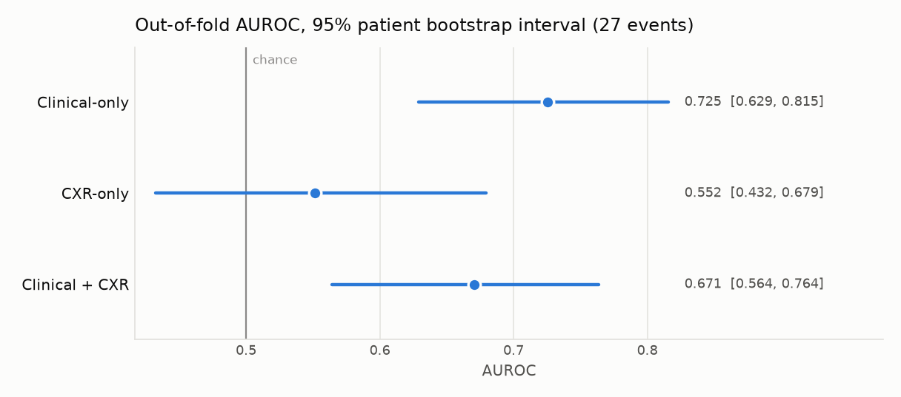
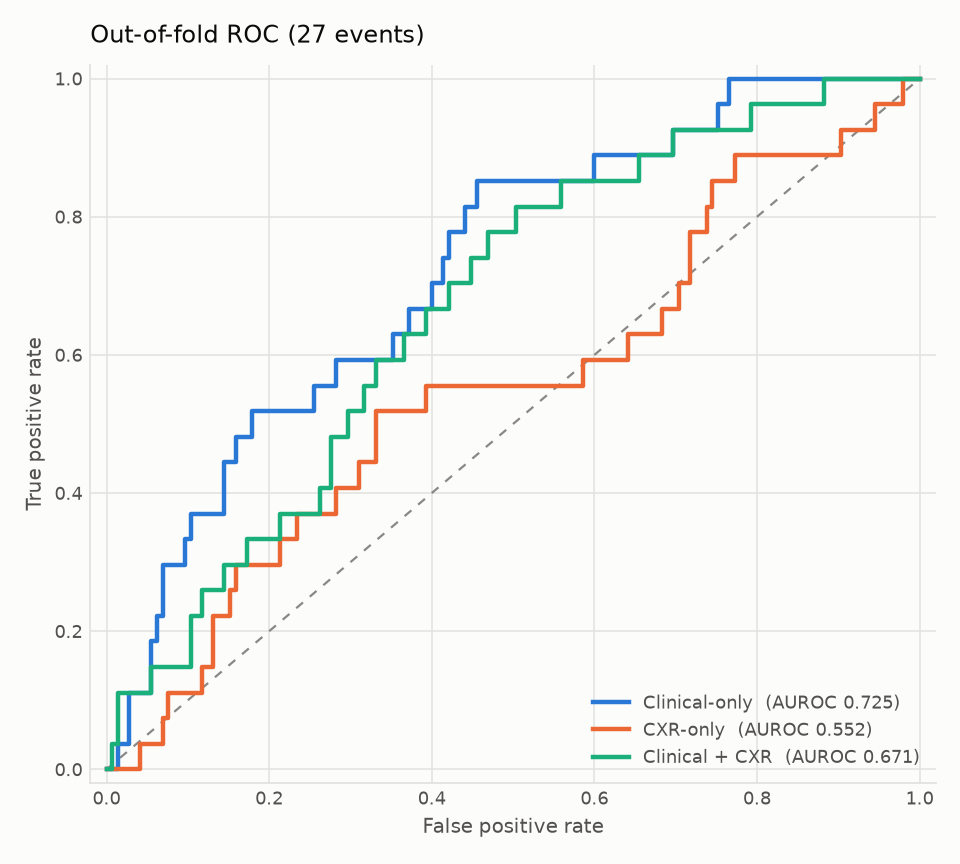
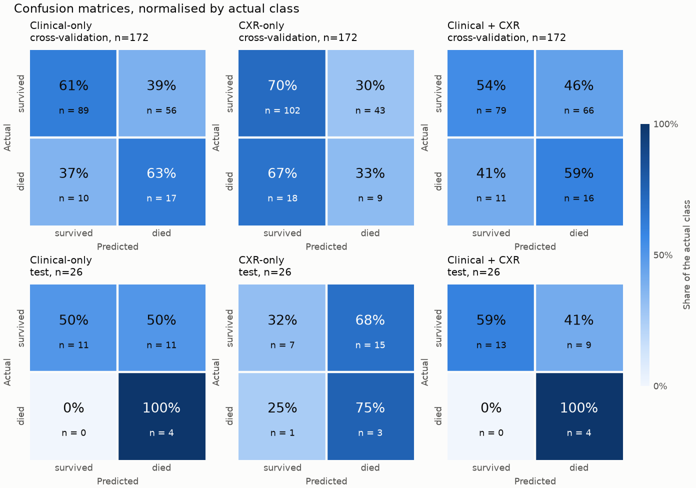

# BN5212：用临床数据和胸片预测 ICU 院内死亡

## 项目目标

患者进 ICU 满 48 小时的那一刻，预测这次住院最后会不会死亡。手上有两种数据：这 48 小时
的临床记录（心率、血压、GCS 等），和这期间拍的一张胸片。我们想回答一个问题：

**只用临床、只用胸片、两者一起用，哪个预测得更好？**

所以训练了三个模型来比较。本目录是训练框架和这三个模型的结果。
环境与运行细节见 [docs/USAGE.md](docs/USAGE.md)，cohort 与评估规则见
[docs/DATA_STRATEGY.md](docs/DATA_STRATEGY.md)。

## 输入数据

| | |
|---|---|
| 数据来源 | MIMIC-IV 3.1（临床）、MIMIC-CXR 2.1.0（胸片，课程子集 5,534 张、1,000 位患者） |
| 研究对象 | 198 次 ICU 住院，来自 159 位患者 |
| 用到的信息 | ICU 入住后前 48 小时的临床记录，和这期间的第一张胸片 |
| 预测时点 | ICU 入住 + 48 小时，此时患者存活且仍在院 |
| 要预测的 | 院内死亡：31 例（15.7%） |
| 划分（按患者） | train 140 / val 32 / test 26 次住院，死亡 23 / 4 / 4 例 |

仓库里没有任何 MIMIC 数据：`results/` 和 `outputs/` 只有汇总指标和图，逐样本预测和模型权重留在本机。

## 方法

| 模型 | 输入 | 做法 |
|---|---|---|
| **Clinical-only** | 17 个临床变量 × 48 小时 | 每个变量各过一个线性层变成一个 token，17 个 token 取平均后分类 |
| **CXR-only** | 一张胸片（224 × 224） | ImageNet 预训练的 ViT-B/16（冻结）提特征，取 CLS token 分类 |
| **Clinical + CXR** | 两者 | cross-attention：每个临床 token 去“看”胸片的各个区域，融合后取平均再分类 |

三个模型用同一套编码器和训练设置，区别只在最后怎么把信息合起来。两个关键做法：

- **临床编码器先预训练。** 我们的 cohort 只有 138 个训练样本，不够学。所以先让它在
  cohort 以外的 12,121 次 ICU 住院上学（外部验证 AUROC 0.848），再冻结拿来用。
  cohort 的 159 位患者全部排除在外，不存在泄漏。
- **影像 backbone 冻结。** 样本太少，微调 ViT 只会过拟合。

训练：AdamW，学习率 1e-3，early stopping，seed 5212。

## 怎么评估

- **5 折交叉验证**（按患者分组，172 次住院、27 例死亡）是主结果：每次住院都由一个
  没见过该患者的模型打分。训练多少 epoch 由内层折决定，被评分的那一折不参与任何选择。
- 主指标是 **AUROC**，95% 置信区间按患者 bootstrap 2,000 次得到。
- **test split**（26 次住院、4 例死亡）只在最后评一次，由 `benchmark-evaluation` 完成。
- 混淆矩阵的阈值用 Youden's J 选，且不在被评分的数据上选。

## 验证与结果

| 模型 | 交叉验证 AUROC（95% CI） | 交叉验证 AUPRC | Test AUROC（95% CI） |
|---|---|---:|---|
| Clinical-only | **0.725**（0.629–0.815） | 0.312 | 0.659（0.457–0.846） |
| CXR-only | 0.552（0.432–0.679） | 0.190 | 0.670（0.124–1.000） |
| Clinical + CXR | 0.671（0.564–0.764） | 0.274 | **0.761**（0.556–0.921） |

随机水平：AUROC 0.5，AUPRC 0.157。







混淆矩阵按真实类别归一化：颜色和大号数字是占该类别的比例，n 是人数。对应的敏感度 / 特异度：

| 模型 | 交叉验证（n=172） | Test（n=26） |
|---|---|---|
| Clinical-only | 63% / 61% | 100% / 50% |
| CXR-only | 33% / 70% | 75% / 32% |
| Clinical + CXR | 59% / 54% | 100% / 59% |

完整数字在 [`results/`](results/)：`summary`、`confusion`、`paired`（两两差异）、`pretraining`。
三个模型各自的交叉验证输出（逐折指标、ROC / PR 曲线、运行记录）在 `outputs/nested_cv/<实验>/`。

## 结论

1. **临床数据有预测力。** Clinical-only 的 AUROC 是 0.725，置信区间下界 0.629，明显高于随机。
2. **单看胸片几乎没有预测力。** CXR-only 是 0.552，区间包含 0.5。
3. **加入胸片没有带来稳定的提升。** 交叉验证里 Clinical + CXR（0.671）没有超过
   Clinical-only；test 上它最高（0.761），但 test 只有 4 例死亡，不足以下结论。
4. **瓶颈是样本量。** 27 例死亡下，三个模型两两之间的差异都不显著（置信区间都包含 0）。

## 汇报时要说明的

- 临床编码器用了 cohort 以外的 MIMIC-IV 患者做预训练，已按患者全部排除 cohort 成员。
- test 只有 4 例死亡，它的数字（包括混淆矩阵）区间很宽，只能当参考。
- 结果来自单一 seed。影像 backbone 冻结在 224 px；MeTra 是在 6,125 位患者上以 384 px 微调。

## 运行方式

```bash
# 1. cohort 的临床特征和影像缓存
bn5212-extract-clinical --run-dir <run> --mimic-root <mimic> --cohort-unit icu_stay \
    --max-hours 48 --output data/clinical_features.csv
bn5212-build-image-cache --run-dir <run> --output data/cache/icu_images.json

# 2. 在 cohort 以外的 ICU 住院上预训练临床编码器
python -m bn5212_training.pretrain cohort --run-dir <run> --mimic-root <mimic> --output data/pretrain/clinical_v1
bn5212-extract-clinical --run-dir data/pretrain/clinical_v1 --mimic-root <mimic> --cohort-unit icu_stay \
    --max-hours 48 --output data/pretrain/clinical_v1/clinical_features.csv
python -m bn5212_training.pretrain fit --cohort data/pretrain/clinical_v1 --encoder variable_projection \
    --config configs/icu/clinical_only.json --output data/pretrain/clinical_v1/variable_projection.pt

# 3. 三个模型的交叉验证
bn5212-crossval --config configs/icu_pretrained/clinical_only.json --output-dir outputs/nested_cv --run-id v3
bn5212-crossval --config configs/icu/cxr_only.json --output-dir outputs/nested_cv --run-id v2
bn5212-crossval --config configs/icu_pretrained/cross_attention.json --output-dir outputs/nested_cv --run-id v3

# 4. 导出表和图
python scripts/export_results.py
```

`python -m pytest`：171 项测试全部通过，全部基于合成数据。
