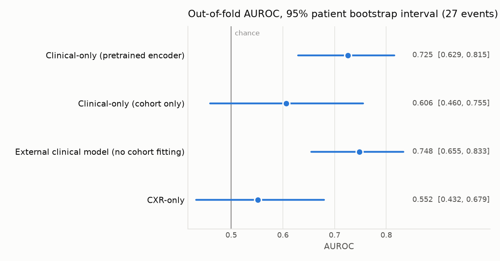
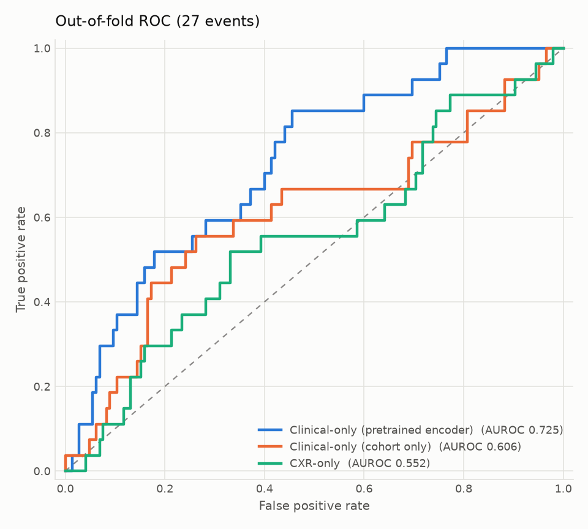

# BN5212：训练框架与单模态基线

## 项目目标

用 MIMIC-IV 临床时序和 MIMIC-CXR 胸片预测 ICU 患者的院内死亡。本目录负责所有实验共用的
训练框架，以及两个单模态基线：**clinical-only** 和 **CXR-only**。

仓库里没有任何 MIMIC 数据，`results/` 只有汇总指标和图。环境与运行细节见
[docs/USAGE.md](docs/USAGE.md)，cohort 与评估规则见 [docs/DATA_STRATEGY.md](docs/DATA_STRATEGY.md)。

## 输入数据

| | |
|---|---|
| 数据 | MIMIC-IV 3.1、MIMIC-CXR 2.1.0（课程子集：5,534 张 DICOM、1,000 位患者） |
| 研究单位 | ICU 住院：198 次、159 位患者 |
| 观察窗口 | ICU 入住后的前 48 小时 |
| 预测时点 | ICU 入住 + 48 小时，此时患者存活且仍在院 |
| 标签 | 院内死亡：31 例（15.7%） |
| 划分（按患者） | train 140 / val 32 / test 26 次住院，死亡 23 / 4 / 4 例 |

## 方法

### Clinical-only

```
17 个变量 × 48 个小时格 + 观测掩码 → 每个变量各一个线性层 → 17 个 token（64 维）
→ 带掩码的平均 → LayerNorm → 线性层 → P(死亡)
```

- 变量是 MIMIC benchmark 的 17 项（生命体征、GCS、血糖、pH、FiO2、身高、体重）。
  按变量做 z-score；缺失的小时填 0，掩码为 0。
- 一条测量只有在预测时点之前既已记录（charttime）又已入库（storetime）才会使用。
- **预训练。** 编码器先在 cohort 以外的 12,121 次 ICU 住院（1,100 例死亡）上训练，
  用另外 2,188 次外部住院选模（AUROC 0.848），之后冻结。cohort 的 159 位患者按
  `subject_id` 全部排除，入选规则与 cohort 相同。

### CXR-only

```
ICU 住院的第一张 AP 胸片，224 × 224 → ViT-B/16（ImageNet 预训练，冻结）→ 线性层 768 → 64
→ CLS token → LayerNorm → 线性层 → P(死亡)
```

- 增强：随机裁剪（比例 0.85–1.0）、旋转 ±10°、亮度和对比度 ±0.15。不做水平翻转。

### 训练与评估

- AdamW，学习率 1e-3，weight decay 0.1，5 个 epoch warmup 后 cosine 衰减，二元交叉熵，
  batch 16，early stopping（patience 15），seed 5212。
- **5 折患者分组 nested 交叉验证**，跑在 train + val 上（172 次住院、27 例死亡）。
  每个外层折里用 4 个内层折决定训练多少 epoch，再用全部拟合患者重训，留出折只评分一次。
- 指标：汇总 out-of-fold 预测后的 AUROC，95% 置信区间来自按患者 bootstrap 2,000 次。
- test split 只评一次，由 `benchmark-evaluation` 完成，用的是在 train + val 上重训的模型。

## 验证与结果

| 模型 | 交叉验证 AUROC（95% CI） | 交叉验证 AUPRC | Test AUROC（95% CI） |
|---|---|---:|---|
| Clinical-only，预训练编码器 | **0.725**（0.629–0.815） | 0.312 | 0.659（0.457–0.846） |
| Clinical-only，只用 cohort | 0.606（0.460–0.755） | 0.260 | 0.591（0.230–0.923） |
| CXR-only | 0.552（0.432–0.679） | 0.190 | 0.670（0.124–1.000） |

随机水平：AUROC 0.5，AUPRC 0.157。预训练出的临床模型不在 cohort 上拟合任何参数、
直接套用时是 0.748（0.655–0.833）。





- 编码器见过足够多的患者之后，临床数据有信号：区间下界 0.629。
- CXR-only 和随机分不开。
- 27 例死亡下，任意两个模型的差异都不显著。预训练对只用 cohort：+0.119（−0.051 到 +0.278）。
- test split 只有 4 例死亡，区间太宽，不能用来给模型排序。

### 消融

| 选择 | 变体 | AUROC |
|---|---|---:|
| 影像编码器（交叉验证） | ViT-B/16 冻结（采用） | 0.552 |
| | ViT-Tiny，解冻最后 2 个 block | 0.495 |
| | DenseNet121 CheXpert，冻结 | 0.478 |
| | ViT-Tiny 冻结 | 0.462 |
| 临床编码器，只用 cohort（交叉验证） | 所有变量共用一个投影 | 0.606 |
| | 每个变量各一个投影 | 0.597 |
| | 汇总统计量 | 0.512 |
| 临床编码器，预训练（外部验证） | 每个变量各一个投影（采用） | 0.848 |
| | 所有变量共用一个投影 | 0.791 |

影像编码器做不了同样的预训练：课程子集里 cohort 以外的患者只有 7 例院内死亡。改用
「拍片后 180 天内死亡」作代理标签（844 张胸片），外部 AUROC 仍在 0.50–0.58 之间
（`scripts/probe_external_image_signal.py`）。

同一框架也训练融合模型（concat、MeTra joint self-attention、cross-attention），数字见
[results/all_models.md](results/all_models.md)。

`python -m pytest`：165 项测试全部通过，全部基于合成数据。

## 运行方式

```bash
# 1. cohort 的临床特征和影像缓存
bn5212-extract-clinical --run-dir <run> --mimic-root <mimic> --cohort-unit icu_stay \
    --max-hours 48 --output data/clinical_features.csv
bn5212-build-image-cache --run-dir <run> --output data/cache/icu_images.json

# 2. 在 cohort 以外的 ICU 住院上预训练临床编码器
python -m bn5212_training.pretrain cohort --run-dir <run> --mimic-root <mimic> --output data/pretrain/clinical_v1
bn5212-extract-clinical --run-dir data/pretrain/clinical_v1 --mimic-root <mimic> --cohort-unit icu_stay \
    --max-hours 48 --output data/pretrain/clinical_v1/clinical_features.csv
python -m bn5212_training.pretrain fit --cohort data/pretrain/clinical_v1 --encoder variable_projection \
    --config configs/icu/clinical_only.json --output data/pretrain/clinical_v1/variable_projection.pt

# 3. nested 交叉验证
bn5212-crossval --config configs/icu_pretrained/clinical_only.json --output-dir outputs/nested_cv --run-id v3
bn5212-crossval --config configs/icu/clinical_only.json --output-dir outputs/nested_cv --run-id v2
bn5212-crossval --config configs/icu/cxr_only.json --output-dir outputs/nested_cv --run-id v2

# 4. 导出表和图
python scripts/export_results.py
```

| 路径 | 内容 |
|---|---|
| `src/bn5212_training/` | 训练循环、编码器、fusion 模块、交叉验证、预训练 |
| `configs/icu/`、`configs/icu_pretrained/` | 不带 / 带预训练临床编码器的实验配置 |
| `results/` | 本页用到的表和图 |
| `docs/` | [USAGE](docs/USAGE.md)、[DATA_STRATEGY](docs/DATA_STRATEGY.md)、[FUSION_API](docs/FUSION_API.md)、[CLINICAL_FEATURE_SPEC](docs/CLINICAL_FEATURE_SPEC.md) |

## 后续工作

- 交叉验证只有 27 例死亡，test 只有 4 例，且只跑了一个 seed。
- 影像 backbone 冻结在 224 px；MeTra 是在 6,125 位患者上以 384 px 全模型微调。
- 课程压缩包里的 `chartevents` 在约 72% 的患者处被截断。study cohort 完全覆盖，
  预训练 cohort 因此只有 14,309 次住院。
